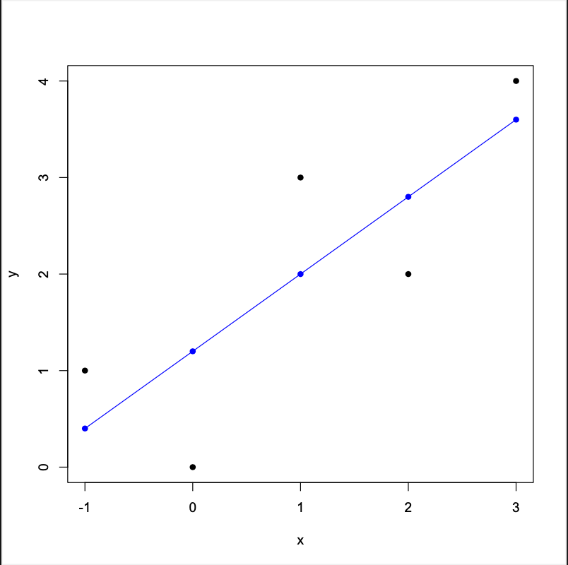
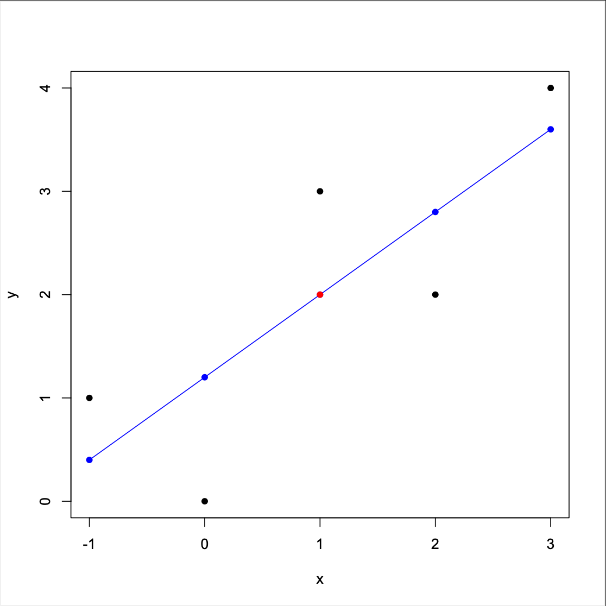

# This homework is written by Nguyen Xuan Thuan (412707007)

### Define the data

    x <- c(3, 2, 1, -1, 0)
    y <- c(4, 2, 3, 1, 0)

    mean_x=mean(x)

    x_minus_mean_x= x - mean(x)
    square_x_minus_x_mean= (x - mean(x))^2

    mean_y=mean(y)

    y_minus_mean_y= y - mean(y)
    x_minus_meanx_multiply_y_minus_meany=(x - mean(x))*(y - mean(y))

## ch02.01 (a)

### Question: Complete the entries in the table. Put the sums in the last row. What are the sample means $\bar{x}$ and $\bar{y}$?

|      $x$      |      $y$       |       $x-\bar{x}$       |      $(x-\bar{y})^2$       |       $y-\bar{y}$       |       $(x-\bar{x})(y-\bar{y})$       |
|:-------------:|:--------------:|:-----------------------:|:--------------------------:|:-----------------------:|:------------------------------------:|
|       3       |       4        |            2            |             4              |            2            |                  4                   |
|       2       |       2        |            1            |             1              |            0            |                  0                   |
|       1       |       3        |            0            |             0              |            1            |                  0                   |
|      -1       |       1        |           -2            |             4              |           -1            |                  2                   |
|       0       |       0        |           -1            |             1              |           -2            |                  2                   |
| $\sum{x_i}=5$ | $\sum{y_i}=10$ | $\sum{(x_i-\bar{x})}=0$ | $\sum{(x_i-\bar{x})^2}=10$ | $\sum{(y_i-\bar{y})}=0$ | $\sum{(x_i-\bar{x})(y_i-\bar{y})}=8$ |

### Answer

$\bar{x}$ = 1 $\bar{y}$ = 2

    sum_x=sum(x)
    sum_y=sum(y)
    sum_x_minus_mean_x = sum(x_minus_mean_x)

    sum_square_x_minus_x_mean = sum(square_x_minus_x_mean)
    sum_y_minus_mean_y = sum(y_minus_mean_y)
    sum_x_minus_x_mean_multiply_y_minus_meany = sum(sum(x_minus_meanx_multiply_y_minus_meany))

## ch02.01 (b)

### Question: Calculate b1 and b2 using (2.7) and (2.8) and state their interpretation.

$b2 = \frac{\sum{(x_i-\bar{x}) \cdot (y_i -\bar{y})}}{\sum{(x_i - \bar{x})^2}} \quad (2.7)$\
$b1 = \bar{y} - b_2\bar{x} \quad (2.8)$

    b2=sum(x_minus_meanx_multiply_y_minus_meany)/sum(square_x_minus_x_mean)
    b1=mean(y)-b2*mean(x)

### Answer

b1=1.2 b2=0.8

we can obtain the least squares estimates for the intercept and slope parameters $\beta_1$ and $\beta_2$

$\hat{Y}$ = 1.2 + 0.8${X_i}$

When $X$ increases by 1, $Y$ is expected to increase by 0.8, when $X$ equal 0, $Y$ is expected equal 1.2

## ch02.01 (c)

### Question: Compute $\sum_{i=1}^{5} x^2_i$, $\sum_{i=1}^{5}x_i y_i$ Using these numerical values, show that $\sum{(x_i-\bar{x})^2} = \sum{x^2_i - N \bar{x}^2}$ and $\sum{(x_i - \bar{x}) (y_i - \bar{i}) = \sum{x_i y_i - N \bar{x} \bar{y}}}$

**Sample code**

    N <- length(x)

    x_square <- x^2
    sum_of_x_square <- sum(x_square)
    x_mul_y <- x*y
    sum_x_mul_y <- sum(x_mul_y)

    sum_of_square <- (sum_of_x_square - (N*mean_x^2))
    covariance_xy <- (sum_x_mul_y - (N*mean_x*mean_y))

$x = [3,2,1,-1,0]$\
$y = [4,2,3,1,0]$\
$\bar{x} = 1$\
$\bar{y} = 2$\

### Answer

$\sum_{i=1}^{5} x^2_i = 15$\
$\sum_{i=1}^{5} x_i y_i = 18$  $\sum{(x_i-\bar{x})^2} = 10$\
$\sum{x^2_i - N \bar{x}^2} = 10$\
$\sum{(x_i - \bar{x}) (y_i - \bar{i})} = 8$\
$\sum{x_i y_i - N \bar{x} \bar{y}} = 8$

# ch02.01 (d)

### Question: Use the least squares estimates from part (b) to compute the fitted values of $y$, and complete the remainder of the table below. Put the sums in the last row. Calculate the sample variance of $y$, $s^2_y = \sum_{i=1}^{N}(y_i - \bar{y})^2 / (N-1)$, the sample variance of $x$, $s^2_x = \sum_{i=1}^{N}(x_i - \bar{x})^2 / (N-1)$, the sample covariance between $x$ and $y$, $s_{xy} = \sum_{i=1}^N (y_i-\bar{y})(x_i - \bar{x}) / (N-1)$ the sample correlation between $x$ and $y$, $r_{xy} = s_{xy} / (s_x s_y)$ and the coefficient of variation of $x$, $CV_x= 100(s_x/\bar{x})$. What is the median, 50th percentile, of $x$? \### The Ordinary Least Squares (OLS) Estimators $b_2 = \frac{\sum{(x_i-\bar{x}) \cdot (y_i -\bar{y})}}{\sum{(x_i - \bar{x})^2}} \quad (2.7)$

$b_1 = \bar{y} - b_2\bar{x} \quad (2.8)$\

**The calculate result is:**  $b_2 = 0.8$\
$b_1 = 1.2$

    mean_x = mean(x)
    mean_y = mean(y)

    sum_of_square = sum((x-mean_x)^2)
    covariance_xy = sum((x-mean_x)*(y-mean_y))

    N = length(x)

    b2 = covariance_xy / sum_of_square # 0.8
    b1 = mean_y - b2*mean_x # 1.2

------------------------------------------------------------------------

| $x_i$ | $y_i$ | $\hat{y}_i$ | $\hat{e}_i$ | $\hat{e}_i^2$ | $x_i \hat{e}_i$ |
|:-----:|:-----:|:-----------:|:-----------:|:-------------:|:---------------:|
|   3   |   4   |     3.6     |     0.4     |     0.16      |       1.2       |
|   2   |   2   |     2.8     |    -0.8     |     0.64      |      -1.6       |
|   1   |   3   |      2      |      1      |       1       |        1        |
|  -1   |   1   |     0.4     |     0.6     |     0.36      |      -0.6       |
|   0   |   0   |     1.2     |    -1.2     |     1.44      |        0        |
|   5   |  10   |     10      |  -2.22e-16  |      3.6      |    -1.33e-15    |

------------------------------------------------------------------------

    sample_variance_y = sum((y-mean_y)^2)/(N-1)
    sample_variance_x = sum((x-mean_x)^2)/(N-1)
    covariance_x_y = sum((y-mean_y) * (x-mean_x))/(N-1)
    correlation_x_y = covariance_x_y/(sqrt(sample_variance_x) * sqrt(sample_variance_y))
    coefficient_variation_x = 100*(sqrt(sample_variance_x)/mean_x)
    quantile(x, probs = c(.25, .5, .75))
    median(x)

### Answer

The sample variance of $y$ = 2.5\
The sample variance of $x$ = 2.5\
The sample covariance between $x$ and $y$ = 2\
The sample correlation between $x$ and $y$ = 0.8\
The coefficient of variation of $x$ = 158.1139\
The median, 50th percentile, of $x$ = 1

# ch02.01 (e)

### Question:On graph paper, plot the data points and sketch the fitted regression line $\hat{y} = b1+b2*x$

**According to the part (d)**\

| $x_i$ | $y_i$ | $\hat{y}_i$ |
|:-----:|:-----:|:-----------:|
|   3   |   4   |     3.6     |
|   2   |   2   |     2.8     |
|   1   |   3   |      2      |
|   0   |   0   |     1.2     |
|  -1   |   1   |     0.4     |

    x = c(3,2,1,0,-1)
    y = c(4,2,3,0,1)
    estimate_y = c(3.6,2.8,2,1.2,0.4)

    plot(x, y,
         xlab="x", 
         ylab="y",
         pch = 16, 
         col = 1
         )
    points(x,estimate_y, 
           pch=16,                
           col="blue")  
    lines(x, estimate_y, col = "blue")

### Answer

# ch02.01 (f)

### Question: On the sketch in part (e), locate the point of the means ( $\bar{x}$, $\bar{y}$ ). Does your fitted line pass through that point? If not, go back to the drawing board, literall.

**According to the part (d)**, $\bar{x} = 1, \bar{y} = 2$

( $\bar{x}$, $\bar{y}$ ) = ( 1, 2 )，on the sketch in part (e), we can see fitted line pass through the point of the means ( 1, 2 ).

| $x_i$ | $y_i$ | $\hat{y}_i$ |
|:-----:|:-----:|:-----------:|
|   3   |   4   |     3.6     |
|   2   |   2   |     2.8     |
|   1   |   3   |      2      |
|   0   |   0   |     1.2     |
|  -1   |   1   |     0.4     |

    x = c(-1,0,1,2,3)
    y = c(1,0,3,2,4)
    estimate_y = c(0.4,1.2,2,2.8,3.6)

    plot(x, y,
         xlab="x", 
         ylab="y",
         pch = 16, 
         col = 1
         )
    points(x,estimate_y, 
           pch=16,                
           col="blue")  
    lines(x, estimate_y, col = "blue")

    points(1,2, 
           pch=16,                
           col="red")  

### Answer

# ch02.01 (i)

### Question: Compute $\hat{σ^2}$

**According to the part (d)**, $b1=1.2, b2=0.8$

    y_hat <- b1 + b2 * x
    residuals <- y - y_hat
    residuals_var <- sum(residuals^2) / (n - 2)

### Answer

$\hat{σ}^2 = 1.2$

# ch02.01 (j)

### Question: Compute $\hat{var}(b2|x)$ and $se(b2)$

    var_b2 <- residuals_var / sum_of_square
    se_b2 <- sqrt(var_b2)

### Answer

$\hat{var}(b2|x) = 0.12$\
$se(b2) = 0.346$
